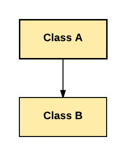
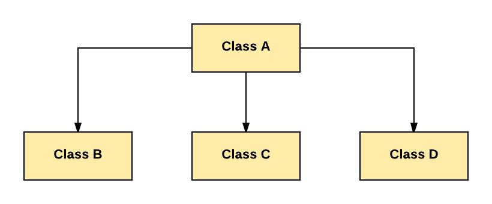
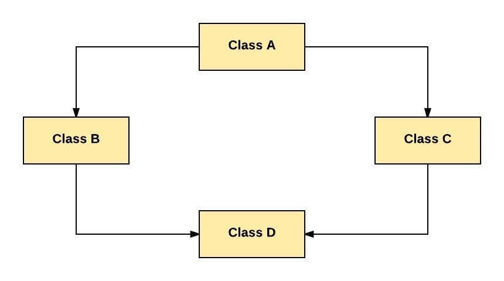

# Kalıtım (Inheritance)
Kalıtım, programlama ortamında da gerçek hayattaki tanımına benzer bir işi gerçekleştirir. Bir sınıfın başka bir sınıftan kalıtım yapması demek, kalıtımı yapan sınıfın diğer sınıftaki nitelik ve davranışlarını kendisine alması demektir. Kalıtımı yapan sınıfa alt sınıf, kendisinden kalıtım yapılan sınıfa ata sınıf dersek, ata sınıfta tanımlı olan herşeyin alt sınıf için de tanımlı olduğunu söyleyebiliriz.

Eğer bir A sınıfın B sınıfından kalıtım yapması isteniyorsa, aşağıda ki şekilde tanımlanır.
```java
 public class A extends B { // }
```
## Kalıtım Türleri
### Tek Yönlü Kalıtım (Single Inheritance)
Bir sınıfın başka bir sınıfı genişlettiği alt ve ata sınıf ilişkisini ifade eder.


Bu örnekte B sınıfı A sınıfını miras alır.
### Çoklu Kalıtım (Multiple Inheritance)
Bir sınıfın birden fazla sınıfı miras almasını ifade eder; bu, bir alt sınıfın iki ata sınıfa sahip olduğu anlamına gelir.

Not : Java çoklu kalıtımı desteklemez. (Interface kullanılır)

### Çok Seviyeli Kalıtım (Multilevel Inheritance)
Bir sınıfa ait alt sınıfın başka sınıfları genişletmesine denir.

Bu örnekte , C sınıfı B sınıfını miras alır, B sınıfı ise A sınıfını miras alır. C sınıfı dolaylı yoldan A sınıfınıda miras almış olur.
### Hiyerarşik Kalıtım (Hierarchical Inheritance)
Birden fazla sınıfın aynı sınıfı genişlettiği bir alt ve üst sınıf ilişkisini ifade eder.


Bu örnekte : B, C ve D sınıfları aynı A sınıfını genişletir.

### Hibrit Kalıtım (Hybrid Inheritance)
Programda birden fazla kalıtım türünün kombinasyonuna denir. Örneğin, A ve B sınıfı, C sınıfını genişletir ve başka bir D sınıfı, A sınıfını genişletir, bu bir hibrit kalıtım örneğidir, çünkü bu, tek yönlü ve hiyerarşik kalıtımın bir birleşimidir.


## Kalıtım'da Constructor Zinciri ve Super Anahtar Sözcüğü
Bir sınıfa ait nesne oluşturulurken, o sınıfın bir kurucusunun işletildiğini, kurucunun çalışması tamamlandıktan sonra bellekte artık bir nesnenin oluştuğunu biliyoruz. Kurucuları da nesneleri ilk oluşturuldukları anda anlamlı durumlara taşıyabilmek için kullanıyoruz. Bu durumda, eğer nesnesi oluşturulacak sınıf başka bir sınıfın alt sınıfıysa, önce ataya ait içnesnesinin oluşturulması ve bu nesnenin niteliklerinin ilk değerlerinin verilmesi gerektiğini söyleyebiliriz.

İçiçe nesnelerin oluşabilmesi için nesnelerin içten dışa doğru oluşması gerekir. İç-nesnenin oluşabilmesi için, nesnesi oluşturulacak sınıfa ait kurucu işletilmeye başladığı zaman ilk iş olarak ata sınıfa ait kurucu çağrılır. Eğer ata sınıf da başka bir sınıfın alt sınıfıysa, bu kez o sınıfın kurucusu çağrılır. Kurucu zinciri alt sınıftan ata sınıfa doğru bu şekilde ilerler. En üstte, kalıtım ağacının tepesindeki sınıfın kurucusunun çalışması sonlandıktan sonra sırası ile alt sınıfların kurucularının çalışması sonlanacaktır. Böylece içiçe nesneler sıra ile oluşturularak en son en dıştaki nesne oluşturulmuş olur ve kurucu zinciri tamamlanır.

### Super Kullanımı
Eğer ata sınıfta varsayılan kurucu yoksa ve programcı alt sınıftaki kurucunun içinde ata sınıfın hangi kurucusunun çağrılacağını belirtmezse derleme hatası alınacaktır. Çünkü derleyici aksi belirtilmedikçe ata sınıfın varsayılan kurucusunu çağıran super() kodunu üretecektir. Ata sınıfın hangi kurucusunun çağrılacağı, super anahtar sözcüğü ile birlikte verilen parametrelere göre belirlenir. Nasıl ki new işleci ile birlikte kullandığımız parametreler hangi kurucunun çağrılacağını belirliyorsa, super anahtar sözcüğü ile birlikte kullanılan parametreler de aynı şekilde ata sınıfın hangi kurucusunun işletileceğini belirler.